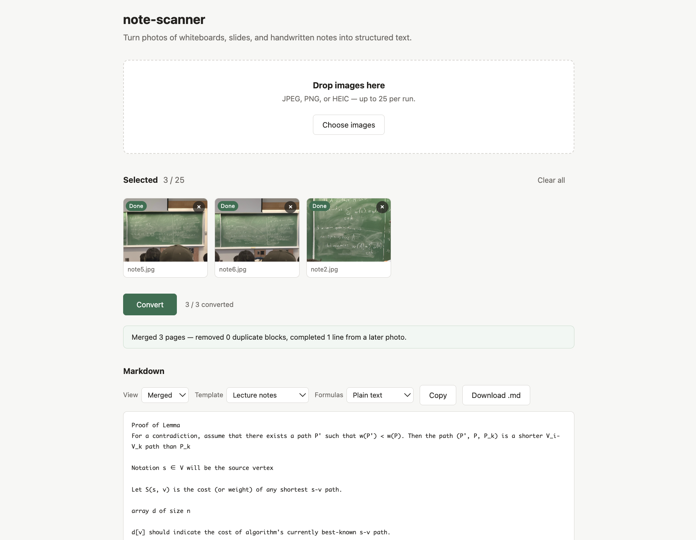

# note-scanner

Turns photos of whiteboards, slides, and handwritten class notes into clean,
structured Markdown.

- Drop up to 25 photos: JPEG, PNG, or HEIC straight off an iPhone.
- A vision model transcribes each one. It ignores circles, arrows, and doodles, and
  marks what it can't read instead of guessing.
- Writing repeated across photos (a board shot more than once) appears once.
- Copy the result or download it as `.md`. Three templates (Lecture notes,
  Practice questions, Freeform) and four formula styles (LaTeX, Unicode, plain,
  code) change the output without re-running the model.



## Run it locally

Needs Node 22+ and [Ollama](https://ollama.com) with the default model:

```sh
ollama pull qwen2.5vl:7b
npm install
npm start          # backend, http://localhost:8787
npm run serve      # frontend, http://localhost:8000 (second terminal)
```

Then open <http://localhost:8000>. To use the Claude API instead of Ollama, copy
`.env.example` to `.env` and set `EXTRACTOR=claude` and `ANTHROPIC_API_KEY`.
Checks: `npm test` and `npm run typecheck`.

## Architecture

- **Frontend:** static HTML/JS with no build step. It normalises each photo
  (orientation, 1568px, JPEG; HEIC via a vendored libheif) and renders Markdown.
- **Backend:** Node/TypeScript (Hono, Zod). It holds the API key; the browser never
  sees it.
- `POST /extract`: one image → schema-validated JSON, with one retry.
- `POST /merge`: removes repeated writing across pages, deterministically, with no
  model call.
- `POST /warmup`: loads the model before the first image needs it.

## AI-assisted workflow

Built with [Claude Code](https://claude.com/claude-code), one phase at a time.
Planning was reviewed and approved before implementation on the main phases. Each
phase lived on its own branch and landed as its own pull request. Ground rules
(branching, no secrets in source, tests with every change, asking before adding
dependencies) are in [`CLAUDE.md`](CLAUDE.md).

How the output was verified:

- **Tests and types:** `node --test` and `tsc` on every commit.
- **Real data:** fixtures are pass-1 output captured verbatim from real lecture
  photos, misreadings included.
- **End to end:** runs against real photos and a live Ollama, and headless Chrome
  for the HEIC path.
- **By hand:** browser verification was part of each phase's checklist.

When evidence overturned a plan, it's recorded in
[`docs/decisions.md`](docs/decisions.md). The full design is in
[`docs/spec.md`](docs/spec.md).
